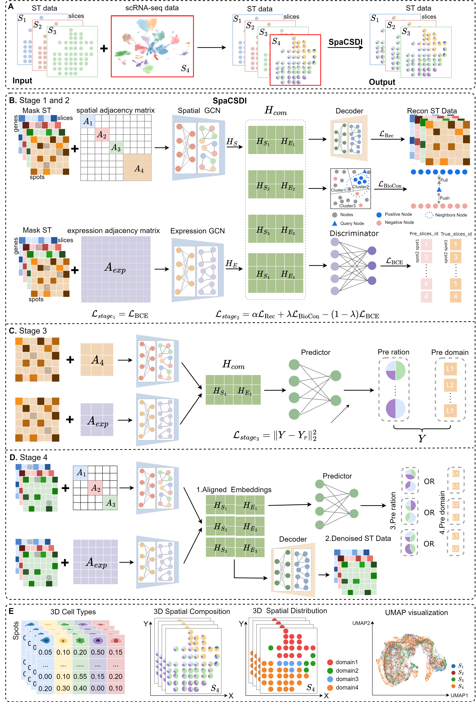

# SpaCSDI

We introduce SpaCSDI (Cross-slice Deconvolution and Integration), a unified end-to-end framework that simultaneously performs cell-type deconvolution, cross-slice alignment, spatial domain identification, and expression denoising within a shared latent representation space. SpaCSDI employs a dual-graph encoder that couples local spatial topology with global transcriptional similarity and integrates self-supervised, contrastive, and adversarial learning to enhance cross-slice consistency while preserving biological interpretability, whereas supervised signals further guide accurate inference of cell-type composition and spatial domains.

## System environment
To run `SpaCSDI`, you need to install [PyTorch](https://pytorch.org) with GPU support first. The environment supporting SpaCSDI and baseline models is specified in the `requirements.txt` file.

## Datasets
The publicly available  datasets were used in this study. You can download them from [Zenodo](https://zenodo.org/records/17539983)

## Run SpaCSDI models
# Quick Start
This section provides a minimal end-to-end guide to reproduce the pipeline locally.
1) Set up the environment
Install the required dependencies (see requirements.txt or your preferred environment file).
Example (conda)
conda create -n spacsdI python=3.10 -y
conda activate spacsdI
pip install -r requirements.txt

2) Get the data

Download the datasets from the data repository and place them under the datasets/ directory.
project-root/
├─ datasets/
│  └─ ...                # place downloaded data here
├─ Baseline/
└─ main_code.py

3) Prepare simulated and intermediate data

Use the provided notebook data_prepare.ipynb and the script dataset.py to generate the simulated datasets and all intermediate files.

 Notebook: data_prepare.ipynb

 Script: dataset.py

4) Configure paths

Update any dataset/file paths in main_code.py to match your local setup.

in main_code.py
DATA_ROOT = "datasets/..."   # <- adjust to your local paths
OUTPUT_DIR = "outputs/..."

5) Run the experiment

Execute main_code.py to start the experiment.

python main_code.py

## Helpful References

1.End-to-end example
See Run_Simulated_data.ipynb for a runnable example and expected outputs.

2.Baselines
A summary of the baseline methods mentioned in the paper is provided in the Baseline/ folder.

3.Evaluation demo
Visualizations of comparative results (e.g., on DLPFC) are demonstrated in evaluate_DLPFC.ipynb.

If anything is unclear in your environment, start by opening the notebooks above and running the cells step by step to reproduce the pipeline.
## Citing

SpaCSDI: Cross-slice Deconvolution and Integration in Multi-sample Spatial Transcriptomics

## Contact
If you have any questions, please contact huanglin212@aliyun.com and minwenwen@ynu.edu.cn
